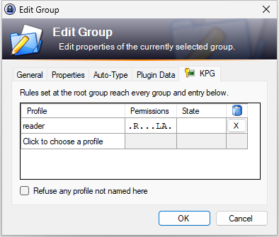
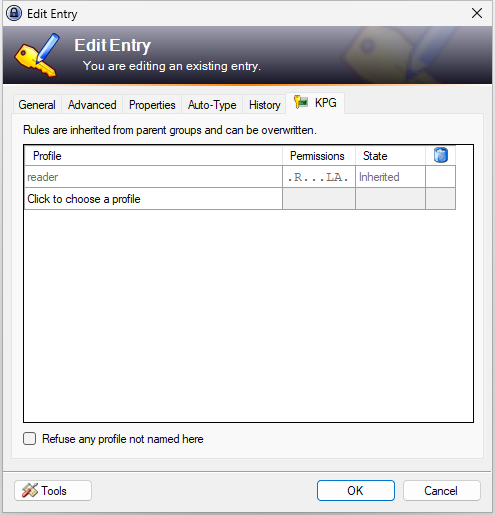
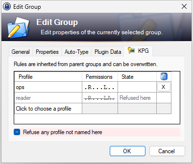
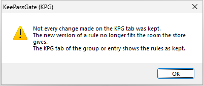
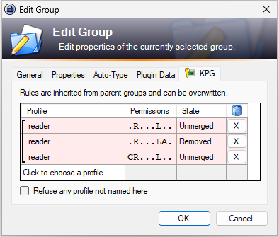
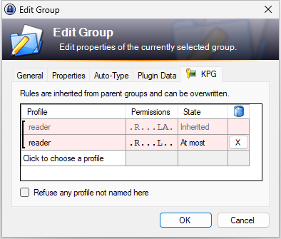

# Deciding what a profile reaches

A profile is a name the database keeps. On its own it grants nothing. The rules that give it
meaning are set for groups and entries, on the **KPG** tab of the group and entry dialogs.

Profiles are managed on the **Profiles** page of the database settings, and approving a pairing can
create one. See [Naming profiles](#naming-profiles).

## Naming profiles

Open **File**, **Database Settings**, pick the **KPG** tab, then the **Profiles** page.

| | |
| --- | --- |
| **Profile** | the name, which is what a rule and a certificate both carry |
| **Rules** | how many groups and entries have a rule for it, whatever the rule grants, an empty rule included, which is how many rules removing it leaves inert; a rule that was removed does not count, and nothing in the recycle bin counts, since no rule there decides anything |
| **Clients** | how many admitted clients hold it, counting only those the gate lets in: the clients page marks the rest |
| **X** | removes it |

**The database needs its certificate authority before a profile is named.** On a database with no
authority the page refuses a name, and the line under the list reads "This database has no
certificate authority yet. Create it on the Certificate Authority page first." Once
[**Create authority**](getting-started.md#create-the-authority) has been pressed, a name can be
added on the same visit to the dialog, and **OK** writes the authority and the name.

Type a name and press **Add**. A name is ASCII letters, digits, hyphens and underscores, up to 64
of them, so the letters are A to Z without accents, and it is not `default` in any mix of capitals,
a name the plugin keeps for itself. It grants nothing until a rule names it.
A database holds as many names as are added, and past the rows the page has room for the list
scrolls down.

The other way one arrives is pairing: a program asks for profiles by name, and any this database does
not name now and no client holds is marked "(new)" on the approval dialog. Approving adds it, and
a rule still naming it from before it was removed applies at once.

A pairing writes that name straight to the database, where every other change on this tab waits for
**OK**, because the name is written by the same operation as the record it belongs to. A name
created that way while this page is holding an edit is kept. What **OK** writes is the last press
made here for each name, held against the list as it stands when **OK** is pressed: a name added
here goes on the list, a name removed here goes off it, and a name a pairing added in the meantime
stays. A name added here and removed again before **OK**, or removed and added again, writes
nothing. The invite button is dead for as long as an edit is waiting all the same, because a
program approved for a profile that is part way through being removed would be admitted to a name
**OK** takes off the list, where it grants nothing.

**A name removed in another copy of the database is not added over that removal.** Copies can be
synchronized while this dialog is open, by a trigger on a timer for instance, and a synchronize
can bring in a removal of a name that was added on this page a moment before. A removal counts
against every addition made without knowing of it, so **OK** does not write that name. Once the
page shows the name gone, the line under the list reads "The profile reader was removed in another
copy of this database while this dialog was open, so OK will not add it." Everything else on the
tab is written at **OK** all the same, and the plugin's log names the name that was left out. To
have the name after all, add it on this page again: that is adding a profile back, below, where
the page asks first.

A name added here that will not be added for any other reason gets a line of its own, "The profile
reader cannot be added to the store as it stands now, so OK will not add it."

**Where the plugin cannot write into its own group in this session, the page shows neither the row
that adds a name nor the X**, and neither while the gate answers `503 split` or `503 outdated` for
the database: the plugin's group then holds the records of more than a single store, or records
that only a later release of the plugin reads. The Certificate Authority page states why.

**Removing a profile takes it off this list and touches nothing else**, and from then on it grants
nothing. A program is given only the profiles its record holds that this list still names, so a
rule naming a removed profile stays where it is, inert, and the **KPG** tab of its group or entry
shows it struck through, with **No profile** as its state. The page states how many rules still
name it and how many clients still hold it.

That holds wherever the rule comes from: a rule set on a group or entry dialog that was open while
the profile was removed and is then accepted, or a copy of the database synchronized in. Neither
can bring a removed profile back into force through its rules, so nothing has to be closed or
checked first.

**Copies of the database that each changed their profiles keep every change once they are
synchronized.** Each name added and each name removed is an entry of its own in the plugin's
group, and a synchronize in KeePass brings each copy the entries it lacks. A name added in a copy
is on the list in every copy it is synchronized with. A name removed in a copy is off the list in
each, including where another copy still named it, or had removed it and added it again without
knowing of this removal: a removal counts against every addition made without knowing of it.
Adding the name again after the synchronize puts it back, and the clients page shows it as removed
on every client holding it until then. After synchronizing copies that each changed their
profiles, check this page.

**The names are entries of the plugin's own group**, `KeePassGate`, and this page is where they
are added and removed: [The plugin's group](getting-started.md#the-plugins-group) covers what
editing or deleting an entry there by hand does.

**Adding a profile back is a full undo.** Every rule still naming it applies again, and every client
still holding it regains it, so the page asks first: it states how many rules come back into force
and names every client that regains the profile, each once by its client key, the fingerprint of the
certificate it paired with: a program that renewed and has not given the older certificate up is one
client, and two programs that chose the same name are two, each named with the start of its key,
"agent (3f2a9c1e)". This replaces naming such a name once with how many certificates it held, which
could not tell the two apart. A client whose certificate has expired is not named, since it regains
nothing: the gate refuses it before its record is read. The one exception is a client that
[renewed](clients.md#expiry) its certificate while the profile was off the list: the certificate it
renewed to was recorded without the profile and does not regain it, while the older one, until the
client gives it up, still holds it and does, which is why the warning still names that client.

**The rules that come back are the rules as every copy of the database left them.** While a name
is off the list, a change to a rule for it shows no effect, so another copy of the database may
have widened such a rule without anybody noticing. After adding a name back in a database that is
synchronized with other copies, look at the rules that name it:
[Copies of a database](#copies-of-a-database) has the rest.

As everywhere else on this tab, nothing is changed until **OK** is pressed on the settings dialog,
and **saving the database** is what puts it on disk. Cancel discards it.

## Where the rules go

Open a group with **Group**, **Edit Group**, or an entry with **Entry**, **Edit Entry**, and pick
the **KPG** tab.

The table has a row for each profile with a rule here or a rule arriving from a group above: the
**Profile**, its **Permissions** as a mask, a **State**, and in the last column an **X**. Under the
table is the check box **Refuse any profile not named here**.

The line at the top states the same thing on both dialogs: "Rules are inherited from parent groups
and can be overwritten." On a group a rule reaches every entry in it and in the groups inside it; on
an entry it reaches that entry, with whatever the groups above grant shown among its own rules. On
the root group, which has nothing above it, the line reads "Rules set at the root group reach every
group and entry below."

**The database needs its certificate authority before a rule is set.** Until then the tab takes no
change and reads "No certificate authority yet. The KPG tab of the database settings creates the
authority." in place of the line at the top:
[create the authority](getting-started.md#create-the-authority) first.

**And it needs a profile.** On a database that names no profile the tab reads "This database names
no profile. Profiles are named on the Profiles page of the KPG tab in the database settings." in
place of the line at the top, and the table offers no line to choose a profile on. The check box
still takes a press.

## Writing a rule

A rule is a profile and an eight character mask. **Neither is typed.** Click the empty line at the
bottom of the table, which reads "Click to choose a profile", and pick a profile from the list,
then pick what it may do from the list the **Permissions** column opens.

The profiles offered are those this database names, less any the table already shows a row for.
A profile a group above grants is already on the table in gray, and the way to change what that
profile may do here is to pick a rule on the row that is already there. A list of profiles too long
to show whole scrolls down, and so does the table once a group or entry holds more rules than the
tab has room for: a group or an entry holds a rule for as many profiles as are chosen.

Nothing here can be typed because both halves are exact. A mask spelled by hand is a rule nobody
meant, and a profile spelled by hand is a rule for a name that may not exist, which grants nobody
anything and reads exactly like a rule that works.

The keyboard opens both lists with **F2** or **Alt+Down** on the cell. Inside a list, **Enter**
accepts and **Escape** leaves things as they were. With no list open, **Enter** and **Escape** are
the dialog's **OK** and **Cancel**, as on the dialog's other tabs.

**Nothing chosen here is written before the dialog's OK.** A row changed on the tab stands on a
light yellow until the dialog closes, and the tooltips of its cells end with "Changed on this tab.
OK writes the change, and Cancel discards the change." [Press OK](#press-ok) has the rest.

**Permissions is unavailable on the empty line**, because a rule is a profile first. It opens by
itself once a profile is chosen.

**Which profile a row is for is settled once the row exists.** To use a different one, remove the
rule with the **X** and choose again. Changing it in place would be two edits wearing one gesture:
the old profile silently loses its rule and the new one silently gains whatever the row held.

The eight characters are always in the same order, and a dot means "not this one":

| | | |
| --- | --- | --- |
| `C` | create | make a new group or entry here, or add a field or an attachment to an entry |
| `R` | read | read a group's notes, or what an entry holds |
| `U` | update | rename a group or change its notes, or change what an entry holds |
| `S` | strip | take fields and attachments off an entry, though not the five every entry has, which are emptied instead |
| `D` | delete | **removals are allowed here**: see below, because this one is asked twice |
| `L` | list | see that something exists, and whether an entry has expired, without reading it |
| `A` | attachments | **and the attachments too**, for whichever of the above this rule grants |
| `P` | protected | **and the protected values too**, for whichever of the above this rule grants |

So `.R...L..` is read and list, and nothing else. `.R...LA.` is the same over entries and over the
attachments inside them. `C.......` is create and nothing else, which is what an append-only program
wants. It still learns one thing about what is there: adding a field or an attachment under a name
the entry already holds is refused as taken, so such a program can find out, one guess at a time,
which names an entry holds. It never learns a value that way.

**A program that may change or strip a part of an entry it is not shown learns the same and
changes nothing doing so.** A tag is the token a program names to change an entry only if nothing
changed since it read it, and a tag that does not match is refused. But a field or an attachment
the entry does not hold is refused as missing before that, so naming a tag that cannot match tells
the program whether a name is there: one guess at a time again, and never a value. That is open to
a program without `R` on the entry, which is handed no tag at all, and to a program with `R` and
`S` and no `A`, which is shown nothing of the attachments and may still strip them.

**A program holding `R` is handed a tag of what its rules let it read, and of nothing else.**
With `P` in the same rule the protected values are in its tag, with `A` in the same rule the
attachments are, and with `A` beside `L` alone their names and sizes are, since that is what
listing them shows. A value a program may not read is in its tag as a mark that something is
there, the same mark whatever the value is, so its tag holds nothing of the value: when such a
program writes a guess at a value it may not read, its tag moves the same whether the guess was
right, with the entry's modification time and with nothing else. A protected title or address
that a listing shows the program, under `L` with `P`, is shown to it by a read as well once it
holds `R`, and is in its tag: what a program is shown of an entry does not depend on which way
it asks.
Two programs that see different
things of an entry hold different tags for it, so a tag passed from one program to another works
only between programs that see the same. A rule widened or narrowed so that a program sees more
of an entry or less makes the tag it holds stale, so its next write under that tag is refused
once and it reads again; a rule widened where nothing new comes into sight, `A` granted over an
entry with no attachments, leaves the tag as it was. And a program that writes a value it may
not read, a password it rotates without `P` beside its `R`, is told that somebody else changed
that value in between only when the change moved the entry's modification time, to the second,
which every edit made in KeePass does. **This replaces an earlier rule**, under which a tag
covered the whole entry and went only to a program whose one rule read all of it, attachments and
protected values included: every entry KeePass makes holds a password, so a program without `P`
was handed no tag at all and could not write against what it had read.

**Nor does writing a value tell such a program what was there.** An update naming only what an
entry, an attachment or a group already holds writes nothing for a program that may read those
values. For a program that may not, it is written like any change, so sending a guess at a value
costs the same and looks the same whether the guess was right. What a program may read here is
what reading the entry would show it, a protected title or address under `L` with `P` included.

**Nor does anything tell a program how long a value it may not read is.** No read and no write
is refused for an entry's size, so no refusal moves with a value: an entry is read whole
whatever it holds, with a value the program is withheld left out, and reading that value's
field alone answers that it is withheld, however long it is. **This replaces an earlier
rule**, under which a write that would take an entry past a size was refused with the entry's
whole size in the refusal: a program that may write and not read could fill an entry up to the
limit and learn from the refusal how long its password was.

**`L` sits below `R` on purpose.** Knowing that an entry exists is not knowing what is in it.

**`S` and `D` are two sizes of removal.** `S` takes parts off a node: an entry's fields and its
attachments. `D` states removals are allowed here, and removing a group or an entry asks for it
**twice**, from the group the thing is leaving and from the thing itself, and one profile has to
grant both.

That is what allows the grant most people want. Put `D` on one group and a program may
create and remove entries and subgroups inside it, including ones it makes later, while **the group
itself stays**, because nothing above it allows removals. Put a rule without `D` on a single entry
and that entry cannot be removed while its siblings still can.

So put `D` on the group whose contents may come and go, rather than at the top of the database. A
`D` at the top is what makes everything below it removable, and then holding one thing back means
writing a rule for it.

**A group is removed only once it is empty**, and a group that still holds something is refused as
such. So a program holding `D` without `L` can find out whether a group it knows of holds anything,
though never what.

**Where a removed entry goes is out of the program's reach.** KeePass moves it to the recycle bin
when the database keeps one, and this API cannot see the bin at all: it is not listed, not
readable, and not addressable. So a program cannot read something by removing it first, unless a
merge later leaves that bin an ordinary group, and getting a removed entry back is done in KeePass,
where it is visible.

**The bin is the group the database names as its recycle bin when a request is served, and no
other group.** A synchronize or an import can change which group that is. When two copies of the
database each made a recycle bin, the merge keeps the choice of one copy, and the group the other
copy used, or this copy's own bin when the other copy's choice is taken, stays in the tree as an
ordinary group. An import can bring another database's bin in as an ordinary group as well. Nothing
remembers that such a group was a bin, so a program reaches it, and everything deleted into it,
the operator's own deletions included, under the rules that reach it where it sits: for a bin
KeePass made under the root, the root's. After a synchronize or an import, check which group
**File**, **Database Settings**, **Recycle Bin** names as the recycle bin, and empty or delete every
other group that was a bin.

**A field whose name begins `KPG.` is the plugin's own**, on whichever entry it is, and is out of a
program's reach as the bin is: no read and no listing shows it, and a program can neither add such
a field nor change or remove it. A field meant for programs needs another name.

**`A` and `P` are switches, not verbs.** Neither means "may read attachments" or "may read
passwords". Each means "and those too", for whatever else the same rule grants, so a rule holding
switches and no verb grants nothing at all.

**`P` is the difference between recognizing an entry and signing in as it.** Without it, a rule that
grants `R` still answers with the title, the address, the names of every field and the values of the
ones nothing protects; where a protected value would be, the answer is `null`. `.R...L.P` is the same
rule with the passwords in it.

**`P` beside `L` shows a protected title and address, and nothing else that is protected.** A
database can protect titles and addresses as it protects passwords. A program is then shown them
when a rule it holds on the entry carries `P` beside `L` or beside `R`, and it is shown them the
same way by a listing and by reading the entry, whichever of the two its rules let it do: what a
program is shown of an entry does not depend on which way it asks. So a program that lists under
`L` with `P` and reads under `R` reads the title it was listed, and a program that reads under `R`
with `P` and lists under `L` is listed the title it reads. The password and every other protected
field still need `R` and `P` in one rule. Without `R` a rule holding `L` with `P` shows the title
in listings and nothing by reading, since reading is not something it grants.

That is the grant to give a program that has to work out which entry it is looking at. `L` alone
does not tell it enough to tell two entries apart, and `R` used to tell it everything.

**It governs changing them too.** A rule with `U` and without `P` can correct an address and cannot
overwrite a password; one with `C` and without `P` can add a field and not a protected one. This is
worth more than it looks: a program that quietly replaces a password with one somebody else chose
has taken the account, and nothing in a log of "an entry was updated" states which happened.

**A write verb reaches further than the entry it is written on.** KeePass resolves what some
fields hold rather than using them as they stand: a URL it is told to open, a value being copied, an
auto-type sequence. A reference to another entry is resolved against the whole open database, which
knows nothing about these rules. So a program that may change one entry can put a reference to
another entry's password where the operator's own click resolves it. So give `U` and `C` as
carefully as `R`, and treat a program holding a write verb on one entry as a program whose values
are going to be read and acted on.

**The gate stores a URL as it is written, whatever KeePass will make of it.** Opening an entry's
URL is where KeePass does the most with what a program wrote. It resolves a reference in it, so the
URL can carry another entry's password to the host it names. It replaces `%NAME%` with the value of
an environment variable. It hands a path, a network share or any scheme Windows has a program for
to that program. And with a URL override switched on, under **Tools**, **Options**,
**Integration**, it puts the URL into a command line, with the entry's user name or password where
the override names them. KeePass asks first only before it runs a command line, and that question
can be switched off. So don't open a URL a program may have written.

**A link in an entry's notes is opened the same way, and by a single click.** The entry view, the
pane under the entry list, makes a link of a web address in the notes, the title, the user name or
a field of the entry's own, percent signs and all, and clicking it hands it to the browser as
opening the URL does: `%NAME%` becomes the value of the environment variable of that name first,
and nothing asks. A brace ends such a link, so a reference does not travel this way. So a program
that may write an entry can put an address of its choosing there with a variable's name in it, and
the operator's click sends the variable's value to that address. A percent sign is as ordinary in a
note as a brace is, so the gate stores it as written, and a link in an entry a program may have
written is to be left alone as its URL is.

**Global auto-type chooses an entry by its title.** When the operator presses KeePass's global
auto-type hot key, an entry matches if its title is contained in the title of the window in front,
and when only one entry matches, KeePass types its user name and password into that window without
asking. So a program with `U` on an entry can rename it after a window whose title the program
chooses, such as a web page it serves, and the operator's next press of the hot key there types a
password the rules never let it read. KeePass resolves a reference in what it types, so a reference
in the user name types another entry's password as well. Where KeePass is also set to match on an
entry's URL, the URL can do the same.
To see which entry is about to be typed, turn on **Always show global auto-type entry selection
dialog** under **Tools**, **Options**, **Advanced**.

**A write verb can also push an entry's older versions out of its history.** Every change the gate
makes to an entry first keeps the entry as it was, as an edit in KeePass does, and KeePass keeps
only as many of those versions as **Database Settings**, **Advanced**, allows, so a program that
changes an entry more times than that has pushed out every version from before it started, and the
audit names each of those writes. A program that may change a value and not read it does so even
by writing the value that is already there, since for that program every update is a change.

**A write verb can also make an entry as large as its program likes.** A request carries at most
65536 characters in a value and 1 MiB in all, and nothing limits how many requests add to an
entry, so a program holding `U` or `C` on an entry can grow it, and the database file and the
time every save takes with it, a request at a time; the audit names each of those writes.
Reading such an entry is not refused: the gate writes the answer as it is sent, so a large
entry costs KeePass little memory, and costs time on the connection that reads it. A program
holding `S` makes the entry smaller by stripping fields. The gate used to refuse the write
that would take an entry past a size, and stopped because the refusal told a program how long
the values it may not read were.

**An attachment is opened by its name.** A program holding `C` with `A` chooses what an attachment
is called, and KeePass hands an attachment it cannot show itself to whatever Windows starts for its
name's ending, a program included, when the operator double-clicks it. The gate refuses a name
holding the characters that reorder how text is displayed, so a program cannot show the operator a
document's name on something that ends in `.exe`, but a name that states `.exe` plainly is still one
it may choose. Whatever a program may create, the operator's KeePass may open.

**A field is filled in by its name too.** The gate refuses a field or attachment name holding a
character drawn as nothing at all, a zero-width space, a joiner, a soft hyphen, a byte order mark,
a variation selector or a Hangul filler among them, so a program holding `C` cannot add a second
field drawn exactly as `Password`, beside the real `Password` and holding what the program chose,
for the operator to type a credential into or copy from. A name is not checked for looking like
another in any other way: a letter from another script, or a space at the end, still makes a name
of its own, which the entry's **Advanced** tab shows beside the others.

**What counts as protected is KeePass's own answer**, not this plugin's. KeePass keeps some fields
encrypted in memory, the password by default, and an operator can mark any field or unmark one. A
field nobody protected is not a secret here however secret it reads, so a program given `R` and not
`P` will still be told what is in the notes if nothing protects them.

**A removal can answer "busy" for a moment.** If the database has never had a recycle bin, the
first removal makes one, and while the Database Settings dialog is open it holds its own copy of that
choice: making the bin underneath it would be undone by its OK. So the removal is refused until that
dialog is closed, which is worth retrying rather than an error.

**A change waits while KeePass is busy with something of its own.** A change and the save that keeps
it happen together on KeePass's own thread, and the things KeePass takes a moment over, saving,
importing, synchronizing, exporting, and anything it shows its progress window for, such as **XML
Replace**, all use that thread while they run. A change made in the middle of one of them would be
made against a database that is being written, which ends with half of somebody's import on the disk
or a change a program was told had been saved not being there. So a change waits for KeePass to
finish, for up to half a minute, and answers "busy" when KeePass is still at it after that. While
KeePass is waiting for an answer to a message box, a change answers "busy" at once, since nothing
happens on that thread until the box is closed. While KeePass's TAN wizard is open on the database,
every change answers "busy" too, since the wizard adds its entries from inside its own OK, which can
land part way through the save the change ends in. Every refusal of this kind tells the program to
come back in two seconds.

**Neither switch applies to `S` or `D`.** Removing something shows nobody anything, and a rule
that may remove an entry already takes everything in it. So `...S....` removes an attachment on its
own, and asking for a switch first would forbid the smaller act while allowing the larger.

**With one exception, and it is about `C` rather than `S`.** A rule holding both `S` and `C` could
take a protected field away and put another back under the same name, which ends with a protected
field holding a value the program chose. That is writing a secret, which is what `P` governs, so a
program is refused the strip of a protected field while any of its profiles holds `C` there without
`P`, whichever profile holds the `S`. A program whose profiles hold no `C` there, or hold it only
with `P`, is unaffected: it has nowhere to put an unprotected value back.

## Inherited rules

Rules from the groups above are shown among the rules set here, in gray, with **Inherited** as
their state and nothing in the last column:

Gray means the rule is not set at this group or entry; a group above sets it. There is nothing to
remove here, which is why the last column is empty on those rows.

This is deliberate. A table listing only what is set here would report nothing for an entry that a
group above already opens wide, and somebody reading that would be invited to grant more.

**A rule chosen on an inherited row replaces the inherited rule here and below.** The tooltip of
the new rule's mask states which way: "Narrows", "Widens", "Replaces" or "The same as", then the
inherited mask.

**A line through the mask, with Refused as the state, is a rule that stops at this group or
entry.** That is what an inherited rule looks like once **Refuse any profile not named here** is
ticked here: the rule still stands above, and nothing of it is let through. The row stays on the
table because seeing what the check box refuses is the reason for ticking it. To let such a profile
in, click its mask, choose what it may do here and press **Enter**, which puts a rule of this group
or entry's own on the row. **Enter** keeps the check marks even when they are the same as the rule
above already had; clicking away from them does not, so looking at a refused rule never lets it
through.

**A line through the mask, with No profile as the state, is a rule for a name that is off the
database's list**, set here or arriving from above. It grants nothing until the profile is added
back on the **Profiles** page, and its tooltip states as much. A rule from above that the ticked
box refuses stays refused once the name is back, and its tooltip states that too. Hovering over the
profile shows its whole name, which the column cuts where the name is long.

## Nearest wins

For any one profile, the nearest rule wins.

- A rule on the entry beats every group above it.
- A rule on a group beats the groups above that one.
- A profile that no rule names is answered by whatever the groups above state.

Different profiles do not interfere: they are worked out separately and combined, so a program
holding two profiles may reach what either of them reaches. A change has to be allowed by one
profile, though: removing an entry needs `D` from one profile in both places, and two profiles
holding one `D` each do not add up to it. Listings are where profiles work together: a listing can
be taken from a group one profile may list, and shows every item in it that any profile the program
holds may list, with a protected title where a profile it holds carries `P` beside `L` or `R` there.

An empty mask is a rule too. `........` on a group grants that profile nothing from there down,
until a nearer rule below names the profile again, which is how a subtree is closed off for one
profile while leaving the rest alone. A rule further down that names the profile still grants what
it states, so look below before relying on the closing. A profile just
picked arrives with exactly that, so a new rule starts by granting nothing and is opened
deliberately.

## Refusing everything not named

The check box at the bottom, **Refuse any profile not named here**, is stronger than any rule and
worth understanding before using.

Without it, a profile with no rule here keeps whatever the groups above grant it. With it, this node
refuses every profile it does not name, and a grant from a group above stops reaching here or
anything under it.

It closes the way in from above, not the way in from below: a group or entry under this one that
names a profile itself still grants what its own rule states, because the nearest rule about a
profile is the one that answers.

Use it on a group holding things no program should reach.

**Clearing the box lets through every profile the table then shows as inherited**, each as far as
its grant from above reaches at that press. A profile whose rule here was removed while the box was
ticked is among them. To keep such a profile out, give it a rule on the same tab before **OK**: an
empty mask keeps it out altogether.

**The box can show a third mark, neither ticked nor clear.** Copies of the database set the box
differently, and until it is set again the gate refuses every profile not named here, as a ticked
box does. The first press ticks it and the next clears it; [Copies of a
database](#copies-of-a-database) has how it comes about.

## Removing a rule

The **X** in the last column removes the rule of its row at this group or entry, also while
**Refuse any profile not named here** is ticked. Until the dialog closes, the row shows what the
profile is left with: the rule a group above grants, as **Inherited**; the same rule struck
through, as **Refused**, where the box is ticked; or a row with no letter where no rule arrives
from above.

**A removed rule is not an empty rule.** An empty mask is a rule: it keeps the profile out here and
below whatever a group above grants. A removed rule leaves the profile to the groups above.

**A profile whose rule was removed is given what the groups above grant, and at most what they
granted when the rule was removed.** A rule widened above later, in this copy of the database,
carries this group or entry along: the **OK** that widens the rule above lets the wider grant
through here as well. Where that **OK** could not, since the rules below were changed while its
dialog was open, [the plugin's log](getting-started.md#the-plugins-log) names the group or entry
it left. A widening that arrives from another copy of the database carries nothing along. Either
shows here as an **At most** row, which [Copies of a database](#copies-of-a-database) describes.
The same holds where the box was cleared: every profile it let through is given at most what
reached this group or entry at that press.

**A rule removed while the box was ticked lets nothing through**, since nothing was let through
when it was removed, and it stays so where another copy of the database clears the box. Clearing
the box on this tab lets that profile through with the rest, as above.

## Reading the State column

The State cell of a row holds a word, or nothing for a rule set here that stands alone and is in
force as shown. Hovering over the cell shows a tooltip explaining the word for that row: what
happened, what the gate grants the profile here, and what a press on the row does.

| State | The row | What the gate grants the profile here |
| --- | --- | --- |
| *(empty)* | a rule set here | the permissions shown |
| **Inherited** | gray: no rule here, so the rule of a group above applies | the permissions shown, or, with an **At most** row under it, what both rows share |
| **Refused** | gray and struck through: **Refuse any profile not named here** is ticked, so the rule from above stops here | nothing |
| **At most** | under an inherited row, bound to it by a bracket: the rule here was removed when less arrived than arrives now, and this row shows what arrived then | what this row and the inherited row share; the **X** lets the whole rule through |
| **Unmerged** | a row of several bound by a bracket: copies of the database set the rule differently before they were synchronized, and each row is the rule of a copy | what all the rows share, until a single rule is left; the **X** removes this row |
| **Removed** | a row among such rows: in this copy the rule was removed | as for **Unmerged** |
| **Missing** | no letter: the rule's record was deleted by something other than the plugin, and its content is gone | nothing, until a rule is chosen on the row |
| **Unreadable** | no letter: the rule's record is there and cannot be read | nothing, until a rule is chosen on the row |
| **No profile** | struck through: the database's list does not hold the name | nothing, until the name is added back |

Where several states hold for a row, the cell shows the first of **No profile**, **Missing**,
**Unreadable**, **Unmerged**, **Removed**, **At most**, **Refused** and **Inherited**, and the
tooltip has a line for each. **At most**, **Unmerged** and **Removed** arise where copies of a
database are synchronized, and [Copies of a database](#copies-of-a-database) describes what to do
about each. An **At most** row with the inherited row above it, and the rows of an **Unmerged**
rule, stand on a light red, and the letters in which their masks differ are bold.

**A Missing or Unreadable rule is refused rather than skipped.** Nobody can tell what the rule
was taking away, so the profile is granted nothing at that group or entry, and nothing under it
unless a nearer rule answers. A rule chosen on the row replaces the record at **OK**, and the
**X** takes the rule off. A **Refuse any profile not named here** setting whose record is missing
or unreadable shows the box ticked, with a tooltip stating so, and refuses every profile not named
there until the box is set again. Such a rule on a group above refuses below as well, and is
replaced on the group that holds it. A rule goes **Missing** where the entries that held it in
[the plugin's group](getting-started.md#the-plugins-group) were deleted, by hand or by a program
other than KeePass; some such deletions end the serving of the whole database, as that section
describes.

## When the tab changes nothing

**The tab shows the rules and takes no change** in these cases. The table then has no **X** and
opens no list, the check box is gray, and a line over the table gives the reason, in place of the
line that states where rules come from:

- **No certificate authority yet**, as [Where the rules go](#where-the-rules-go) has it.
- **The plugin's data cannot be used.** "The data of KeePassGate in this database cannot be used,
  so no rule can be written." The gate then serves nothing of the database either, and the
  Certificate Authority page of the database settings states why.
- **KeePass's dialogs could not be watched.** "The dialogs of KeePass could not be watched in this
  session, so no rule can be written." [The plugin's log](getting-started.md#the-plugins-log) names
  what was missing, and nothing is written into the plugin's group until KeePass is started again.
- **A group or an entry of the plugin's own.** "Data of KeePassGate. No client reaches the data, so
  no rule applies here."
  An entry of the operator's own is taken for the plugin's where its identifier begins as the
  identifiers of the plugin's entries do, which a random identifier meets about once in one and a
  half million entries: duplicating that entry in KeePass gives the copy a new identifier, and the
  copy takes rules.
- **Several entries edited together.** "Several entries at once. Rules are shown and changed for a
  single entry." Open an entry by itself to change its rules.
- **An earlier version of an entry**, opened from its **History** tab. "An earlier version of the
  entry. The rules shown are the rules of the entry as the rules stand now." A rule belongs to the
  entry and to no version of it, so the tab shows every row the entry's own tab shows.
- **A KeePass that does not tell the plugin which database, group or entry the dialog is about.**
  The line names which, and [the plugin's log](getting-started.md#the-plugins-log) what was
  missing.

## Press OK

**The rules changed on the tab are written by the dialog's OK, all of them together, and discarded
by Cancel, Escape and the close box.** Nothing is written while the dialog is open. KeePass asks
whether to keep an entry's changes only where the entry itself changed, so **Escape** after
changing rules alone discards them without a question.

**OK puts the rules in force at once and marks the database as changed.** The gate decides its
next request by them. KeePass's title shows the database as changed, also where nothing else on
the dialog was touched, and KeePass treats the rules as any unsaved change when it closes, locks
or exits.
**Saving the database** is what puts them in the file, as for any edit. A change of rules alone
gives the group or entry no new modification time and an entry no new version in its history.

**A change that OK did not keep is told in a message once the dialog has closed**, titled
"KeePassGate (KPG)". Where part of what was changed was written it begins "Not every change made
on the KPG tab was kept." and ends "The KPG tab of the group or entry shows the rules as kept.",
so open the tab again to see which rules stand. Where nothing was written it begins "No change
made on the KPG tab was kept." Between them is a line for each cause:

| The line | What happened | What to do |
| --- | --- | --- |
| "The new version of a rule no longer fits the room the store gives." | the rule was changed more often than its record has room for | the rule stands as it was; the plugin's log names it |
| "The rules of the group or entry changed in the database while the dialog was open." | the rules there were changed between the press and **OK**, by a synchronize for instance | open the tab again and make the change against what it shows |
| "The data of KeePassGate in this database cannot be used as the data stands." | the plugin's group stopped being usable while the dialog was open | the Certificate Authority page of the database settings states why |
| "A change was not in a form the store takes." | the change was none the tab offers | the plugin's log has the details |

A message that begins "No change made on the KPG tab was kept:" gives the cause after the colon:
KeePass was part way through something of its own, a dialog was open that would have undone the
write, such as **Database Maintenance**, or the database stopped taking rules while the dialog
was open. Close what is open, open the tab and make the change again. A message that begins "A
defect stopped the write" is a fault of the plugin's own, and the rules may or may not have been
kept: open the tab to see.
[The plugin's log](getting-started.md#the-plugins-log) names the group or entry by the first
eight characters of its identifier, never by its title, with every rule that was not written.

The **KPG** tab in the database settings dialog works the same way: both tabs hold every change
until OK, and OK and Cancel do what they promise.

## Where a rule is stored

In the plugin's own group in the database, `KeePassGate`, beside the certificate authority and the
clients, under the identifier of the group or entry it is about. It travels with the database, it
is covered by the database's encryption, and nothing is written on the group or entry itself.

**A rule stays with its group or entry and with nothing else.** A group or an entry moved elsewhere
keeps its rule. A copy is a group or an entry of its own, with an identifier of its own, so
**Duplicate Entry** and **Duplicate Group**, copying entries or a group into another group or
another database, and making an entry from a template give the copy no rule: the copy grants what
reaches it from the groups above. So a copy of an entry that a rule of its own kept narrow is as
open as the group it lands in: look at the **KPG** tab of the copy, and set its rule, before
relying on it. An earlier version of an entry, restored from its history, changes no rule.

## Copies of a database

Rules can be changed in two copies of a database before the copies are synchronized in KeePass,
on two machines for instance. Each change is an entry of its own in the plugin's group, so a
synchronize brings each copy the changes it lacks, and the gate never grants more at a group or
entry than the rules standing there allow together.

**Different profiles changed at the same group or entry do not meet.** Both changes hold, and
nothing is left to settle.

**The same profile's rule changed in both copies stands in both versions.** The tab shows a row
for each copy's rule, bound by a bracket, with **Unmerged** as the state, or **Removed** for a
copy in which the rule was removed. Until a single rule is left, the gate grants what all the
rows share, which the tooltip of each row states. To choose among them, remove the rows that are
not wanted with their **X**: the row that is left is a rule like any other, and can be changed on
the same tab before **OK**. A row of such a group offers its **X** and no list, so no single press
grants more than some copy's rule held. Where each copy removes a different row before the copies
meet again, every row is back afterwards, and the choice is made again in a copy that holds them
all.

**The check box set differently in two copies shows its third mark**, and the gate refuses every
profile not named there until the box is pressed: [Refusing everything not
named](#refusing-everything-not-named).

**An At most row is a grant from above held back to what it was.** Where a rule was removed, or
the box cleared, in a copy, and a rule above was widened in another, the group or entry gives the
profile what the first copy gave: the inherited row shows the wider rule that arrives, and the
**At most** row under it the permissions that arrived when the rule here was removed or the box
cleared. The gate grants what both rows share. To let the whole grant through, press the **X** on
the **At most** row and then **OK**: the inherited row then stands alone. An **At most** row with
no letter is a rule that was removed while the box was ticked, and grants nothing until its **X**
is pressed. A group or entry whose rule was removed keeps what it recorded where it is moved, so
under a group that grants more than its former place it shows an **At most** row the same way.

**What the plugin cannot settle between copies**, each because the database then holds exactly
what a single careful operator could have made on purpose:

- **A rule above narrowed in a copy and widened again in another that never saw the removal
  below.** A group or entry whose rule was removed gives again what it gave when the rule was
  removed, and never more. Synchronize both ways before changing a rule above a group or entry
  that another copy changed.
- **Two rules removed in two copies, the upper of which granted exactly what arrived at it
  anyway.** Nothing marks either place, and the next widening above both reaches the lower. Before
  widening a rule, look at the tabs of the groups and entries below it that have no rule of their
  own.
- **A group or entry with no rule of its own, moved in a copy while a rule above its new place was
  changed in another.** What has to stay closed wherever it is moved needs a rule of its own.
- **An At most row that stopped holding anything back is forgotten.** Once a rule above is
  narrowed, in the copy that holds the row, to what the row allowed, the **At most** row goes,
  and a later widening above in that copy carries the group or entry along.
- **A name added back in a copy while a rule for it was widened in another**, as [Naming
  profiles](#naming-profiles) has it.

After synchronizing copies that each changed rules, open the **KPG** tabs of the groups and
entries that were changed and read their State columns.

## What a program actually gets

Two answers, and both have to allow it:

1. **The admission record**, which lists the profiles approved for that certificate. Only the ones
   this database still names count.
2. **The rules**, which state what those profiles reach.

The record is read from the open database on every request, so removing it takes effect at once.
A node a program may not reach and a node that does not exist answer the same way, so a refused
program cannot map the database by asking.

**What a program may see still names the group it is in**, by identifier, even where the rules
hide that group. So a program shown an entry inside a group it may not reach learns that the group
is there and which of what it is shown share it, though never the group's name or anything else in
it.

**A program can ask what it may do at a group or an entry** before it tries. It is told one mask for
each profile it holds, written as this tab writes them, and nothing about a profile it does not
hold. Each mask is what the gate grants that profile at that group or entry: where this tab shows
an **At most** row or **Unmerged** rows there, the mask is what those leave, and for a **Missing**
or **Unreadable** rule it holds no letter. It is about that group or entry alone, so a `D` on an
entry can still be refused by the group it is in, which removing it asks as well. A switch beside
nothing but `S` or `D` is left out, since it reaches nothing removing does not already take. A group
or an entry where none of its profiles may do anything is answered as one that does not exist, and
the audit records the question as it records any other.

Nothing else is asked. An entry KeePass shows as expired, by its date or after **Expire Now**, is
still served, because expiry is KeePass's advice to whoever uses the entry rather than a control.
A program holding `R` is told when an entry expires, one holding `L` may ask a listing to leave the
expired ones out, and one holding `U` may move the date or take it off, as it would after rotating
the password. To take a retired credential out of a program's reach, take it out of the rules.

**What a program reads is what the entry stores.** A field reference such as `{REF:P@I:...}` or a
placeholder such as `{USERNAME}` reaches it as that text, not as the value KeePass would show or
type, because resolving one reads another entry, or the machine, without asking the rules. An entry
that borrows its password from another by reference gives a program the reference, and the program
needs the rules on the other entry to read what it points at. The reference client follows such a
reference when it is asked to by reading the other entry through the gate, so the rules on that
entry decide, and the audit has a line for the read.

**A program's new entry expires only when the program asks it to.** KeePass can give every new
entry an expiry, under **Tools**, **Options**, **Security**. An entry a program creates gets that
expiry when the program asks for it, and none when it does not, so a rotation policy set there
reaches what a program makes only where the program asked for it.
